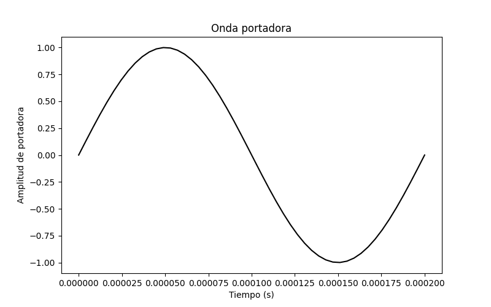
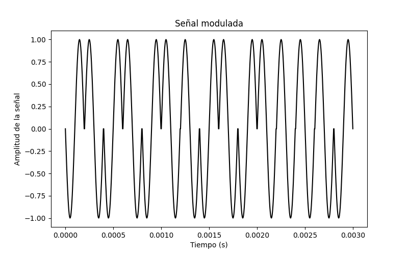
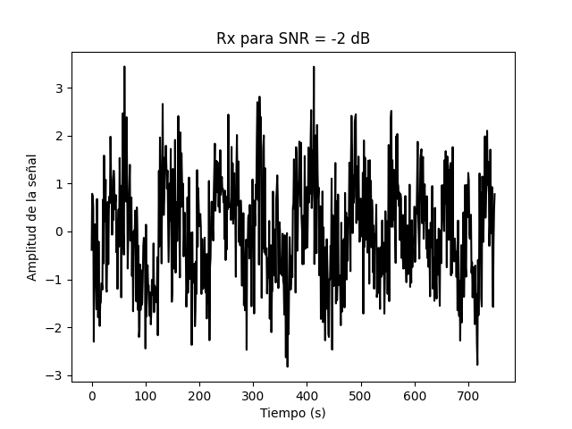
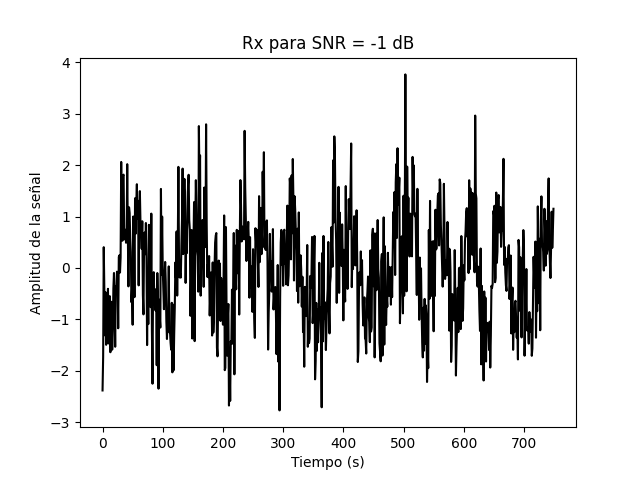
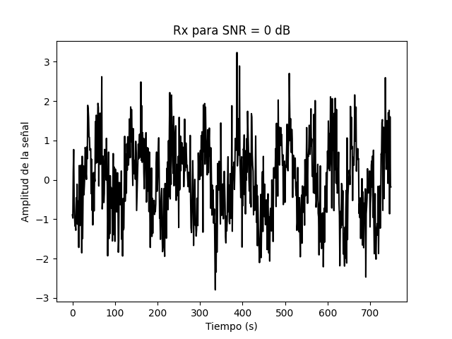
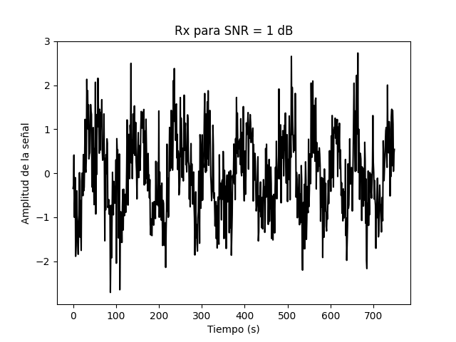
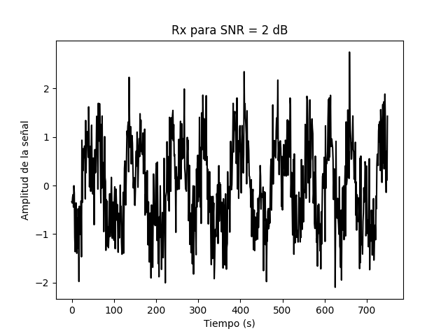
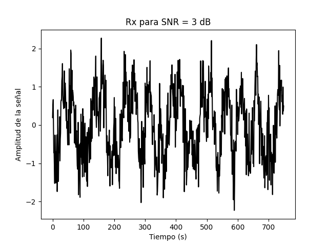
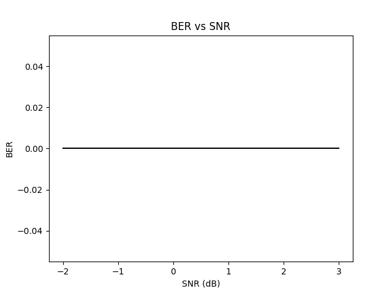

# Tarea4

## 1. Esquema de modulación BPSK
En el esquema BPSK se cambia la fase de la onda portadora ante el valor del bit que se quiera transmitir. Como onda portadora se utilizó una función senoidal con la siguiente forma: 

 

 

Ante la llegada de un bit 0 le corresponde un desfase de 0 grados y  ante la llegada de un bit 1 el desfase correspondiente es de 180 grados. Matemáticamente:

Con los primeros 15 bits del archivo `bits10k.csv`, se obtiene la señal modulada con la siguiente forma:

 

Para obtener este resultado se procedió de la siguiente forma. Se cargó los bits proporcionados en un obketo iterable utilizando el metodo `genfromtext()`, se definió la frecuencia de la onda portadora en 5 kHz y la frecuencia de muestreo en 250 kHz. Para crear la señal, se definieron estos parámetros y se creó un objeto iterable de tipo linspace que se ajusta a los mismos con 0 en todos sus elementos. Luego, en cada espacio de un periodo se sumó la señal sinusoidal asociada al bit correspondiente.

## 2. Potencia promedio de la señal modulada generada

Para hallar la potencia promedio se basa en la formula 

A nivel de código, se utilizó el metodo `integrate.trapz` para integrar la variable de la señal al cuadrado. El resultado es .
## 3. Canal ruidoso del tipo AWGN con una relación señal a ruido (SNR) desde -2 hasta 3 dB

Para simular el canal ruidoso se utiliza una distribución normal definida por la media  y por la desviación estandard 

donde 

Teniendo el modelo del canal ruidoso, se definió un lista con los valores de SNR requeridos (-2 a 3) y con eso se realizó la simulación. A continuación se presentan las formas de la señal Rx resibida para cada nivel de SNR:

 

 

 

 

 

 

Se observa como con un nivel de SNR de -1 el ruido 

## 4. Densidad espectral de potencia de la señal con el método de Welch, antes y después del canal ruidoso

 

 

 

 

 

 

## 5. Demodular y decodificar la señal y hacer un conteo de la tasa de error de bits
## 6. Grafica BER versus SNR

 

